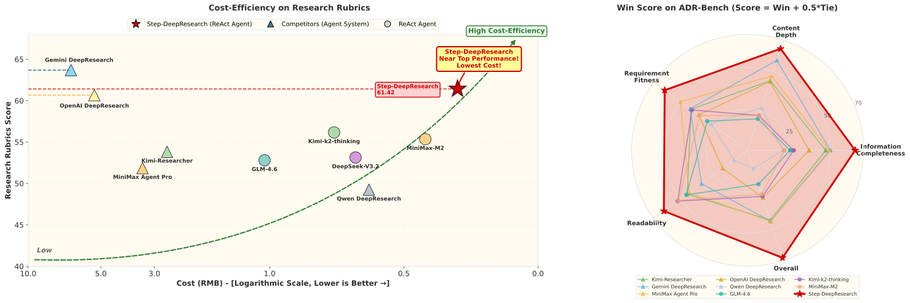
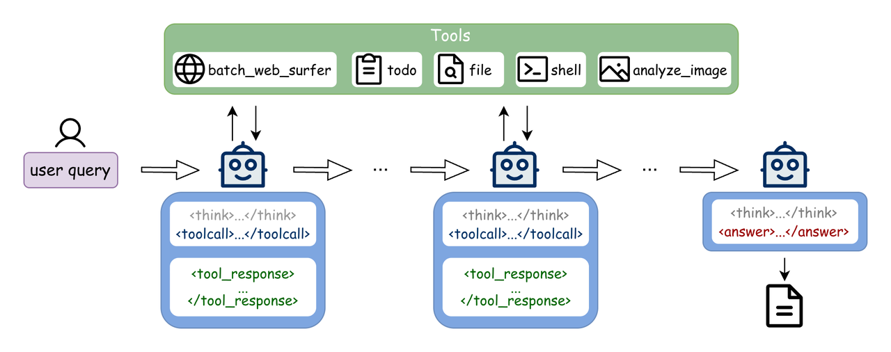

# Step-DeepResearch

<div align="center">
  
</div>
<div align="center" style="line-height: 1;">
  <a href="https://stepfun.com/" target="_blank"></a> &ensp;
  <a href="https://x.com/StepFun_ai" target="_blank"></a> &ensp;
  <a href="https://discord.com/invite/XHheP5Fn" target="_blank"></a>
</div>
<div align="center">
  <a href="https://arxiv.org/pdf/2512.20491"></a> &ensp;
  <a href="https://platform.stepfun.com/interface-key"></a>
  <a href="https://github.com/stepfun-ai/StepDeepResearch/blob/main/LICENSE"></a>
</div>


## News
* Dec 25, 2025: 👋 You can join our group chat to get updates on your beta API application status and the latest project developments.
  <div align="center">
    
    
  </div>

* Dec 24, 2025: 👋 You can get beta access to the model API by completing the form. [Get Access](https://wvixbzgc0u7.feishu.cn/share/base/form/shrcn8CP78PJgkjvvIh2C3EF3cc) 
* Dec 24, 2025: 👋 We have made our technical report available. [Read](https://arxiv.org/pdf/2512.20491)


## Introduction
### Model Summary
  **Step-DeepResearch** is a cost-effective, end-to-end deep research agent model designed for autonomous information exploration and professional report generation in open-ended research scenarios.
  - **Atomic Capability Integration**: By decomposing complex research tasks into trainable atomic capabilities—including planning, information seeking, reflection and cross-validation, and professional report generation—and achieving deep internalization at the model level, the system ensures closed-loop reflection and dynamic correction within a single inference pass.
  - **Progressive Training Pipeline**: We establish a complete optimization path from Agentic Mid-Training to Supervised Fine-Tuning (SFT) and Reinforcement Learning (RL), reshaping the training objective from "predicting the next token" to "deciding the next atomic action." This approach effectively enhances the model's adaptive capabilities and generalization performance in complex environments.
  - **Strong Performance Across Model Scales**: With only 32B parameters, Step-DeepResearch achieves 61.4% on Scale AI Research Rubrics, matching OpenAI Deep Research and Gemini Deep Research. In expert human evaluations on ADR-Bench, its Elo score significantly outperforms larger models including DeepSeek-v3.2 and GLM-4.6, and rivals top-tier closed-source models.
  - **Superior Cost-Effectiveness**: With extremely low deployment and inference costs while maintaining expert-level research capabilities, Step-DeepResearch stands as the most cost-effective deep research agent solution currently available in the industry.
  - **Access**: Available via StepFun Open Platform API, free for the first month.

  <div align="center">
    <br/>
    (left) <b>Cost-Efficiency on Research Rubrics:</b> Step-DeepResearch achieves near-top performance (61.42) while significantly reducing inference costs (RMB), positioned at the high-efficiency frontier. 
    (right) <b>Expert Evaluation on ADR-Bench:</b> Step-DeepResearch consistently leads in Elo ratings across all dimensions, rivaling top-tier closed-source models.
  </div>
  
### System Architecture
  Step-DeepResearch adopts a single-agent architecture based on the ReAct paradigm, enabling autonomous deep research through a dynamic cycle of reasoning, action, and reflection.

  Building upon our internal proprietary toolset, we provide a streamlined toolset with local implementation in the framework, including `batch_web_surfer` (batch web search and browsing), `file` (file reading, writing, and editing), `todo` (task state management), and `shell` (interactive command execution), to support the complete research workflow. For a comprehensive introduction to our full toolset, please refer to Section 5.2 of the technical report.

  <div align="center">
  
  <p><b>Step-DeepResearch System Architecture:</b> The agent operates within a ReAct loop, utilizing a specialized toolset (e.g., batch_web_surfer, todo, shell) for planning, execution, and reflection to generate comprehensive research reports. </p>
  </div>

## Case

We provide a sample case below, including the query and the model-generated report.

### Query

```text
我是个 AI 产品经理，正在考虑给产品增加个性化记忆功能。想系统了解一下现在 Agent 里的 Memory 模块都在往哪些方向发展，包括短期和长期记忆是怎么做的、各种技术路线的差异和取舍。你帮我写个调研报告，从工程落地和未来演进的角度分析一下 哪些方向更值得投入
```

### Model Output (Report)

<details style="height: 520px; max-height: 90vh; overflow-y: auto; resize: vertical; border: 1px solid #e5e7eb; border-radius: 8px; padding: 12px 16px;">
<summary><b>Click to expand the report</b></summary>


# AI Agent记忆模块深度调研报告：技术演进与产品化路径

## 一、引言与核心问题界定

### 1.1 记忆能力为何成为Agent时代的分水岭

在Agentic AI加速渗透的2025年，智能体已从"能对话、会调用工具"的基础形态，向"具备长期记忆、可自主进化"的高阶阶段迈进[大模型进阶之路：AI Agent记忆能力构建技术详解（值得收藏）](https://blog.csdn.net/xxue345678/article/details/150983939)。正如OpenAI CEO山姆·奥尔特曼在2025年12月的Big Technology访谈中所言："这是整个系统里我个人最期待的部分之一。AI的下一个重大飞跃并非是更敏锐的推理能力，而是更为根本的记忆"[超级Agent重要拼图？奥尔特曼点名“AI记忆” 存储环节迎来新叙事](https://finance.sina.com.cn/stock/t/2025-12-22/doc-inhcsmfc4526733.shtml)。他进一步指出，"人类本身是有局限的：即使你拥有世界上最好的私人助理，他们也不可能记住你说过的每一句话，不可能读过你的每一封邮件，不可能看过你写的每一份文件"——而这正是AI能够做到的[超级Agent重要拼图？奥尔特曼点名“AI记忆” 存储环节迎来新叙事](http://m.cls.cn/detail/2236511)。

当前，大多数人以为通过更大的上下文窗口或巧妙的提示词工程，AI就拥有了"记忆"，但真相是，大多数AI Agent仍是无状态的，无法从过去的交互中学习，也无法随时间适应用户需求[探寻AI Agent 中隐秘的角落：记忆(Memory) - 定义、价值与实践](https://developer.volcengine.com/articles/7540134113190412324)。要从一次性工具迈向真正智能的伙伴，我们需要为AI赋予真正的记忆，而非仅仅依赖更大的提示或更强的检索。

### 1.2 记忆的本质定义

在AI Agent中，记忆是指跨时间、任务和多次用户交互，保留并调用相关信息的能力[探寻AI Agent 中隐秘的角落：记忆(Memory) - 定义、价值与实践](https://developer.volcengine.com/articles/7540134113190412324)。它让AI能记住过去发生的事，并利用这些信息优化未来的行为。记忆不是简单地存储聊天记录，也不是把更多数据塞进提示框——它是一种持久的内部状态，随着每次交互不断进化，哪怕间隔数周或数月，依然能为AI提供连续的上下文[探寻AI Agent 中隐秘的角落：记忆(Memory) - 定义、价值与实践](https://developer.volcengine.com/articles/7540134113190412324)。

记忆的三大支柱包括：**状态**（了解当前情境，掌握正在发生的事情）、**持久性**（跨会话保留知识，确保信息不因对话结束而丢失）、**选择性**（判断哪些信息值得记住，哪些可以忽略）[探寻AI Agent 中隐秘的角落：记忆(Memory) - 定义、价值与实践](https://developer.volcengine.com/articles/7540134113190412324)。这三者共同赋予AI一种前所未有的能力——连续性。

### 1.3 报告研究范围与目标

本报告旨在系统梳理Agent记忆模块的技术演进方向，深入分析短期与长期记忆的实现机制、各类技术路线的差异与取舍，并从业务价值、技术成熟度和工程可行性三个维度，为产品团队提供明确的技术选型建议和投入优先级排序。

---

## 二、Agent记忆模块的分类体系与核心架构

### 2.1 从认知科学到工程实践的记忆分层

人类记忆遵循从感觉记忆到短期记忆再到长期记忆的一般性进程[A survey on large language model based autonomous agents](https://link.springer.com/content/pdf/10.1007/s11704-024-40231-1.pdf)。当设计Agent记忆结构时，研究者从中汲取灵感：

**短期记忆（Working Memory）**：指AI正在进行的对话、脑中即时活跃的上下文。它容量有限（通常为数千tokens），但访问速度极快[从理论到落地：分层记忆架构在AI Agent中的应用实践](https://blog.csdn.net/whitehat_zhou/article/details/150269603)。例如，在MemGPT架构中，短期工作上下文由系统指令、工作上下文和FIFO队列组成[9.4k Star！MemGPT：伯克利大学最新开源、将LLM作为操作系统、无限上下文记忆、服务化部署自定义Agent](http://www.wehelpwin.com/m_article/5363)。

**中期记忆（Episodic Memory）**：指最近读完的书籍核心内容或近期发生的重大事件。它们比短期记忆更持久，但不如长期记忆根深蒂固[从理论到落地：分层记忆架构在AI Agent中的应用实践](https://blog.csdn.net/whitehat_zhou/article/details/150269603)。这类记忆通常通过向量数据库或结构化存储实现语义检索。

**长期记忆（Long-term Memory）**：指用户的个人经历、学到的技能、世界观以及那些已掌握的知识。它容量近乎无限，但检索可能需要更长时间[从理论到落地：分层记忆架构在AI Agent中的应用实践](https://blog.csdn.net/whitehat_zhou/article/details/150269603)。长期记忆是Agent个性化和持续学习的基础。

### 2.2 三种记忆形式的技术实现

根据2025年最新综述研究，Agent记忆可从形式（Forms）、功能（Functions）和动态（Dynamics）三个正交维度进行重构[2025年Memory最全综述！AI Agent记忆统一分类体系](https://zhuanlan.zhihu.com/p/1985435669187825983)：

**Token级记忆（Token-level Memory）**：信息被处理在模型的上下文窗口内。这是最直接的记忆方式，包括滑动窗口注意力（Sliding Window Attention）和分块处理（Chunking）等技术[EPISODIC MEMORIES GENERATION AND EVALUATION BENCHMARK FOR LARGE LANGUAGE MODELS](https://arxiv.org/pdf/2501.13121v1.pdf)。优点是实现简单、无额外存储开销；缺点是在长序列上存在"上下文腐烂"问题[AI Agent 性能优化：核心策略与实战技巧（超详细）从零基础入门到精通！](https://m.blog.csdn.net/xiaoganbuaiuk/article/details/154012804)。

**参数级记忆（Parameter-level Memory）**：通过微调将知识直接编码到模型参数中。这种方式使信息成为模型"先天具有的知识"，可在任意上下文中激活。优点是检索速度快、无需额外存储；缺点是训练成本高昂、难以增量更新[EPISODIC MEMORIES GENERATION AND EVALUATION BENCHMARK FOR LARGE LANGUAGE MODELS](https://arxiv.org/pdf/2501.13121v1.pdf)。

**潜在级记忆（Latent-level Memory）**：通过检索增强生成（RAG）等外部存储机制实现。信息以向量或结构化形式存储在外存，需要时通过语义检索召回[EPISODIC MEMORIES GENERATION AND EVALUATION BENCHMARK FOR LARGE LANGUAGE MODELS](https://arxiv.org/pdf/2501.13121v1.pdf)。这是当前商业化产品中最广泛采用的方式。

### 2.3 记忆模块在Agent架构中的位置

典型的AI Agent包括LLM用于推理和生成答案、策略或规划模块（如ReAct或AutoGPT风格）、工具或API访问权限以及检索器用于获取文档或历史数据[探寻AI Agent 中隐秘的角落：记忆(Memory) - 定义、价值与实践](https://developer.volcengine.com/articles/7540134113190412324)。然而，这些组件都无法记住昨天发生了什么——它们没有内部状态，也没有随时间进化的理解力。

加入记忆后，AI Agent的架构会发生质的改变：记忆层成为串联其他模块的"数据中枢"[大模型进阶之路：AI Agent记忆能力构建技术详解（值得收藏）](https://blog.csdn.net/xxue345678/article/details/150983939)。Agent架构的四大核心模块（感知、决策、记忆、行动）逐渐清晰，其中记忆模块（Brain-Memory & Knowledge）存储Agent的知识、用户偏好和历史交互记录，是决策与行动的"数据基础"[大模型进阶之路：AI Agent记忆能力构建技术详解（值得收藏）](https://blog.csdn.net/xxue345678/article/details/150983939)。

---

## 三、短期记忆的技术实现与优化策略

### 3.1 上下文窗口的根本限制

大语言模型在单次推理中能够接收和处理的Token数量上限被称为上下文窗口（Context Window），它直接决定了模型的"短期记忆容量"[LLM面试50问精解：从基础到进阶，掌握大语言模型核心知识，助你面试一战成名！大模型面试](https://m.blog.csdn.net/qkh1234567/article/details/155600143)。当前主流模型的上下文长度从4K token（早期GPT系列）发展到128K token（GPT-4o）甚至更长。然而，上下文窗口的扩大存在明显的"性能代价"：

由于Transformer的自注意力机制需要计算序列中任意两个位置之间的相关性，其计算复杂度为O(n²)，内存复杂度同样为O(n²)[Hi，我是 OceanBase PowerMem，了解一下？](http://cdn.modb.pro/db/1994227212866904064)。这意味着当上下文窗口从4K增加到128K（32倍）时，理论上的计算量和内存需求的增长不是32倍，而是1024倍[Hi，我是 OceanBase PowerMem，了解一下？](http://cdn.modb.pro/db/1994227212866904064)。

更重要的是，研究发现有效上下文长度远低于最大支持长度[LLM的长期记忆系统-成为你的个性化聊天陪伴](https://zhuanlan.zhihu.com/p/1917652340346946388)。已有研究表明，LLM的有效上下文长度在达到约2048 tokens后就开始显著下降，模型精度会随着上下文长度的增加而显著下降[LLM的长期记忆系统-成为你的个性化聊天陪伴](https://zhuanlan.zhihu.com/p/1917652340346946388)。

### 3.2 KV Cache优化技术

KV Cache（Key-Value Cache）的有效利用对提高LLM的运行效率至关重要[AI Agent优化技术深度解析：从Prompt到架构的全面指南（珍藏版）](https://m.blog.csdn.net/2401_85375186/article/details/155227353)。当前KV Cache优化可分为三个层次：

**Token级策略**：包括键值缓存选择、预算分配、合并、量化和低秩分解[【文献阅读】A Survey on Large Language Model Acceleration based on KV Cache Management](https://m.blog.csdn.net/Toky_min/article/details/146019523)。代表性技术包括：
- **SnapKV**：无需微调即可有效最小化KV缓存大小。在处理16K令牌输入时，实现一致的解码速度，与基线相比生成速度提高3.6倍，内存效率提高8.2倍[SnapKV: LLM在生成内容之前就知道您在寻找什么](https://blog.csdn.net/qq_36931982/article/details/139118015)
- **LM-Infinite**和**StreamingLLM**：保留初始token和近期token以实现无限长度上下文
- **H₂O**：基于注意力分数选择重要token进行缓存

**模型级优化**：通过架构创新和注意力机制增强键值重用[【文献阅读】A Survey on Large Language Model Acceleration based on KV Cache Management](https://m.blog.csdn.net/Toky_min/article/details/146019523)。例如Layer-Condensed KV Cache通过减少KV Cache层数而非保留所有层来降低内存消耗[Layer-Condensed KV Cache for Efficient Inference of Large Language Models](https://arxiv.org/pdf/2405.10637v2.pdf)。

**系统级方法**：解决内存管理、调度和硬件感知设计等问题[【文献阅读】A Survey on Large Language Model Acceleration based on KV Cache Management](https://m.blog.csdn.net/Toky_min/article/details/146019523)。NVIDIA Dynamo框架就采用了LLM-aware路由器来跟踪GPU集群中KV Cache的位置，当请求到达时计算新请求与缓存KV块之间的重叠度，将流量导向能最大化缓存复用的GPU[NVIDIA Dynamo Addresses Multi-Node LLM Inference Challenges](https://www.infoq.com/news/2025/12/nvidia-dynamo-kubernetes/?utm_campaign=infoq_content&utm_source=infoq&utm_medium=feed&utm_term=global)。

### 3.3 短期记忆的工程实现方案

**LangChain的记忆实现**提供了多种短期记忆方案\cite{web_bd759108}：
- **ConversationBufferMemory**：存储所有历史消息
- **ConversationBufferWindowMemory**：仅保留最近N轮对话（如k=3表示保留最近3轮）
- **ConversationSummaryMemory**：对对话历史生成摘要以节省Token

这种分级设计体现了"选择性"原则——判断哪些信息值得记住，哪些可以忽略[探寻AI Agent 中隐秘的角落：记忆(Memory) - 定义、价值与实践](https://developer.volcengine.com/articles/7540134113190412324)。

---

## 四、长期记忆的技术路线全景

### 4.1 RAG与Memory的区别与联系

RAG（检索增强生成）是OpenAI、Meta等公司提出的一种框架，用来增强语言模型的知识能力[让大模型“记住”更多：RAG与长期记忆](https://m.blog.csdn.net/2401_82452722/article/details/148744627)。然而，需要明确区分RAG与真正的Agent Memory：

RAG主要用于知识问答场景，在这些场景下知识点之间相对独立，一个用户问题往往只需涉及一两个知识点[LLM的长期记忆系统-成为你的个性化聊天陪伴](https://zhuanlan.zhihu.com/p/1917652340346946388)。企业级RAG系统通常会通过人工干预优化chunk划分，因此能够更好地支持知识类检索。

但在"个人记忆"这一场景下存在独特挑战：首先很难依赖人工完成chunk划分；其次用户的提问往往需要LLM进行推理、联想才能找到真正相关的记忆[LLM的长期记忆系统-成为你的个性化聊天陪伴](https://zhuanlan.zhihu.com/p/1917652340346946388)。当前RAG技术将文本按chunk进行切分，对每个chunk独立生成特征向量，在检索阶段query也是独立与每个chunk进行相似度计算——这种做法不仅容易造成信息"割裂"，也难以保证检索到的是上下文完整的语义单元[LLM的长期记忆系统-成为你的个性化聊天陪伴](https://zhuanlan.zhihu.com/p/1917652340346946388)。

### 4.2 主流长期记忆框架对比

#### 4.2.1 MemGPT：操作系统灵感的虚拟内存管理

MemGPT是由UC Berkeley研究团队开发的记忆增强LLM框架，其核心创新是借鉴操作系统内存管理的概念[Meet MemGPT: The Future of Memory-Augmented AI - Medium](https://medium.com/@harshavasana1/meet-memgpt-the-future-of-memory-augmented-ai-9b547bbd3879)：

**主上下文（Main Context）**：类比RAM的短期内存，用于即时处理。包含系统指令、工作上下文和FIFO队列[9.4k Star！MemGPT：伯克利大学最新开源、将LLM作为操作系统、无限上下文记忆、服务化部署自定义Agent](http://www.wehelpwin.com/m_article/5363)。

**外部上下文（External Context）**：类比硬盘的长期存储，用于存放不太常用的信息。MemGPT引入两个外部记忆模块——Recall Memory和Archival Memory，分别对应短期交互记录与长期知识存储[LLM的长期记忆系统-成为你的个性化聊天陪伴](https://zhuanlan.zhihu.com/p/1917652340346946388)。

MemGPT通过函数在主上下文和外部上下文之间移动数据，LLM可以通过在其输出中生成特殊关键字参数来请求立即后续推理，以将函数调用链接在一起；函数链允许MemGPT执行多步骤检索来回答用户查询[9.4k Star！MemGPT：伯克利大学最新开源、将LLM作为操作系统、无限上下文记忆、服务化部署自定义Agent](http://www.wehelpwin.com/m_article/5363)。这种架构不仅允许处理更大的数据集和更长的对话，而且还提高了模型在扩展交互中保持一致性能力[9.4k Star！MemGPT：伯克利大学最新开源、将LLM作为操作系统、无限上下文记忆、服务化部署自定义Agent](http://www.wehelpwin.com/m_article/5363)。

MemGPT的核心优势在于它证明了LLM可以被教会管理自己的内存[9.4k Star！MemGPT：伯克利大学最新开源、将LLM作为操作系统、无限上下文记忆、服务化部署自定义Agent](http://www.wehelpwin.com/m_article/5363)。其后商业化的Letta公司已获得1000万美元种子轮融资，在7000万美元估值下由Felicis Ventures领投[Letta, one of UC Berkeley's most anticipated AI startups, has just ...](https://techcrunch.com/2024/09/23/letta-one-of-uc-berkeleys-most-anticipated-ai-startups-has-just-come-out-of-stealth/)。

#### 4.2.2 Mem0：轻量级实用主义路线

Mem0被官方定义为"The Memory Layer for Personalized AI"（个性化AI的记忆层）[Mem0 获2400万美元融资，开发AI内存层技术-搜索](https://cn.bing.com/search?q=Mem0%20%E8%8E%B72400%E4%B8%87%E7%BE%8E%E5%85%83%E8%9E%8D%E8%B5%84%EF%BC%8C%E5%BC%80%E5%8F%91AI%E5%86%85%E5%AD%98%E5%B1%82%E6%8A%80%E6%9C%AF&rdr=1&rdrig=7UV8W6XI2C2HFZFXE23T7R5222E2IX6F&first=1)。其核心设计理念包括：

- **记忆是可搜索和可管理的**：通过自然语言索引+向量化混合检索
- **以用为先**：轻量级实现适合实际部署
- **结构化存储**：使用slot存储结构化长期信息（如角色设定、兴趣偏好）

Mem0在LOCOmo Benchmark中达到了业界开源Memory解决方案的SOTA水平[Hi，我是 OceanBase PowerMem，了解一下？](http://cdn.modb.pro/db/1994227212866904064)。其设计哲学是"足够好而非完美"——通过可恢复的压缩策略（如仅保留URL而非完整内容）在不永久丢失信息的情况下减少上下文开销[AI Agent 性能优化：核心策略与实战技巧（超详细）从零基础入门到精通！](https://m.blog.csdn.net/xiaoganbuaiuk/article/details/154012804)。

#### 4.2.3 OpenMemory：分层记忆分解架构

OpenMemory是一个自托管、模块化的AI记忆引擎，采用Hierarchical Memory Decomposition（HMD）架构[CaviraOSS/OpenMemory: Add long-term memory to any AI ...](https://github.com/CaviraOSS/OpenMemory)：

- **单一规范节点每记忆**（无数据复制）
- **多扇区嵌入**（情节、语义、程序性、情感、反思性）
- **单一点位链接**（稀疏、生物启发式图）
- **复合相似性检索**（扇区融合+激活传播）

性能对比数据显示[CaviraOSS/OpenMemory: Add long-term memory to any AI ...](https://github.com/CaviraOSS/OpenMemory)：
| 指标 | OpenMemory（自托管） | Zep（云服务） | Supermemory（SaaS） | Mem0 | 向量DB（平均） |
|------|---------------------|---------------|--------------------|-------|----------------|
| 成本 | 自托管 | 按API调用付费 | 按API调用付费 | 按API调用付费 | 按存储+查询付费 |

#### 4.2.4 A-MEM：卡片盒笔记法驱动的记忆系统

A-MEM是一种新型面向LLM Agent的智能记忆系统，遵循卡片盒笔记法（Zettelkasten）的基本原理[A-MEM智能记忆系统，让你的大模型拥有“学习”能力（收藏版）](https://blog.csdn.net/xiaoganbuaiuk/article/details/151215108)：

当添加新记忆时，系统会生成包含多个结构化属性的综合笔记，包括上下文描述、关键词和标签。随后分析历史记忆以识别相关联系，并在存在有意义的相似性时建立链接——这一过程还支持记忆进化——随着新记忆的整合，它们会触发对现有历史记忆的上下文表示和属性更新[A-MEM智能记忆系统，让你的大模型拥有“学习”能力（收藏版）](https://blog.csdn.net/xiaoganbuaiuk/article/details/151215108)。

A-MEM的成本效益分析显示：通过选择性top-k检索机制，每次记忆操作约需1200个tokens，与基线方法（LoCoMo和MemGPT为16900个tokens）相比，Token使用量减少了85%-93%[A-MEM智能记忆系统，让你的大模型拥有“学习”能力（收藏版）](https://blog.csdn.net/xiaoganbuaiuk/article/details/151215108)。

### 4.3 多模态记忆的发展前沿

随着多模态LLM的发展，记忆系统也开始向多模态方向演进：

**M3-Agent**是字节跳动Seed团队提出的新型多模态代理框架，配备长期记忆能力。与人类类似，M3-Agent可以处理实时视觉和听觉输入来构建和更新其长期记忆[Research](https://seed.bytedance.com/en/public_papers)。

**VideoAgent**探讨如何将基础模型（大型语言模型和视觉语言模型）与统一记忆机制协调起来解决视频理解问题。其构建结构化内存来存储视频的通用时间事件描述和以对象为中心的跟踪状态，在NExTQA上平均提升6.6%，在EgoSchema上平均提升26.0%[VideoAgent: A Memory-augmented Multimodal Agent for Video Understanding（翻译）](https://m.blog.csdn.net/weixin_56764022/article/details/139862630)。

---

## 五、OpenAI ChatGPT记忆功能解析：行业标杆案例

### 5.1 发展历程与产品演进

OpenAI的记忆功能经历了三个重要阶段：

**第一阶段（2024年2月）**：小范围测试ChatGPT的记忆功能——记住用户在聊天中讨论过的事情，并避免重复信息。用户可以要求它记住特定的内容或让它自行获取详细信息。用得越多，ChatGPT的记忆力就会越好[ChatGPT要有记忆力了，OpenAI宣布小范围测试“记忆”功能！](http://m.nbd.com.cn/articles/2024-02-14/3245164.html)。

**第二阶段（2025年4月）**：向所有ChatGPT Plus和Pro用户推出记忆提升功能。这次更新后，ChatGPT的记忆功能能够参考用户过去的所有聊天以提供更个性化的回复[OpenAI：ChatGPT的记忆提升功能今天起对所有Plus和Pro用户推出](https://finance.jrj.com.cn/2025/04/11072749477951.shtml)。例如，如果用户曾经提到喜欢泰国菜，下次问"中午应该吃什么"时，ChatGPT可能会考虑到这一点[刚刚！OpenAI发布ChatGPT记忆功能，秒变私人助理！](https://m.blog.csdn.net/Leinwin/article/details/148428926)。

**第三阶段（2025年6月）**：为免费版ChatGPT推出轻量级记忆功能。该功能根据用户过往一段时间内的对话习惯、写作风格、提问方式进行个性化回答[OpenAI发布ChatGPT记忆功能](https://c.m.163.com/news/a/K16NIQ1D0511A6N9.html)。

### 5.2 记忆功能的核心机制

ChatGPT的记忆功能通过两个设置来控制[刚刚！OpenAI发布ChatGPT记忆功能，秒变私人助理！](https://m.blog.csdn.net/Leinwin/article/details/148428926)：

- **"引用已保存的记忆"**：用户明确要求ChatGPT记住的细节（如名字、喜欢的颜色或饮食偏好）
- **"引用聊天历史"**：ChatGPT可以利用过去的对话信息来使未来的对话更有帮助

OpenAI称用户可以随时关闭新功能，在设置菜单中找到个性化选项即可将记忆设置为关闭。用户也可以在设置中找到"管理内存"选项，在其中查看和删除特定的记忆内容或清除所有记忆[ChatGPT要有记忆力了，OpenAI宣布小范围测试“记忆”功能！](http://m.nbd.com.cn/articles/2024-02-14/3245164.html)。

### 5.3 记忆功能的战略意义

投资人Allie K. Miller在X平台上感叹："这相当于ChatGPT全天候在'偷听'——不管你有没有叫它记住，它都在默默收集"[OpenAI最近推出的ChatGPT更新简直像给AI打了“记忆芯片”](https://blog.csdn.net/2301_79342058/article/details/147156180)。她还表示，在平台功能越来越趋同的今天，真正拉开差距的关键就是"记忆+个性化"——AI的记忆就是平台的护城河[OpenAI最近推出的ChatGPT更新简直像给AI打了“记忆芯片”](https://blog.csdn.net/2301_79342058/article/details/147156180)。

OpenAI研究还表明，ChatGPT记住什么或不记住什么与人们如何体验ChatGPT的人格密切相关——许多Plus和Pro订阅者告诉OpenAI，更好的记忆是体验中最有价值的部分之一[超越“一刀切”：ChatGPT如何为8亿用户定制个性化体验| 图文 ...](https://www.zhihu.com/pin/1972634281496057035)。

---

## 六、评测基准与性能分析

### 6.1 主要评测基准概述

当前用于评估Agent Memory的主要数据集包括[Agent 又又失忆了！我来做一次记忆体检](https://juejin.cn/post/7564589641258139648)[Survey on Evaluation of LLM-based Agents](http://arxiv.org/pdf/2503.16416v1)：

**LoCoMo Benchmark**：专门测试长上下文任务的记忆能力，在该基准中Mem0和Letta曾出现过评测分值分歧[2025 AI 记忆系统大横评：从插件到操作系统，谁在定义下一代Agent Infra？](https://m.toutiao.com/a7578151050135044643/)。

**LongMemEval**：UCLA团队开发的系统性基准，更像是一个"记忆体检表"——从信息提取、跨会话推理、知识更新到拒答未知，一共五项指标[Agent 又又失忆了！我来做一次记忆体检](https://juejin.cn/post/7564589641258139648)。

**Reflection-Bench**：上海人工智能实验室开发的认知心理学导向评测平台，围绕七个认知维度设计了354个任务——预测能力与决策能力、感知能力与记忆能力、反事实思维、信念更新、元反思能力等[AI大模型代理评测全攻略：从入门到精通，一篇就够了！](https://m.blog.csdn.net/m0_56255097/article/details/154832865)。

这些评测指标超越了传统的自然语言处理性能指标——聚焦事实信息的存储与利用，通过准确性指标（基于历史信息生成响应的正确性）和召回率@5指标（前5条检索结果中相关信息的占比）来衡量[上下文工程最新综述A Survey of Context Engineering for ...](https://zhuanlan.zhihu.com/p/1956121336968647834)。

### 6.2 性能数据对比

根据MemOS横向评测数据，在实际任务中的表现差异显著[2025 AI 记忆系统大横评：从插件到操作系统，谁在定义下一代Agent Infra？](https://m.toutiao.com/a7578151050135044643/)：

| 技术路线 | 上下文扩展能力 | 检索准确性 | 响应延迟 | 开发复杂度 | 成本效益 |
|---------|--------------|-----------|---------|----------|---------|
| 基础RAG | 中等 | 较低 | 较低 | 低 | 高 |
| MemGPT | 高 | 中等 | 较高 | 高 | 中等 |
| Mem0 | 高 | 较高 | 中等 | 中等 | 高 |
| 向量数据库+自定义 | 可定制 | 高 | 中等 | 高 | 中等 |

---

## 七、工程实践案例与落地挑战

### 7.1 成功案例分析

来自硅谷一线AI创业者的数据显示：只有5%的AI Agent成功部署到生产环境[为什么只有5%的AI Agent落地成功？](https://wwww.huxiu.com/comment/4792610.html)。这5%的成功案例都有一个共同点——都采用了"human-in-the-loop"的设计：
- 将AI定位为辅助工具而非自主决策者
- 构建反馈循环让系统能从人类修正中学习
- 让人类可以轻松验证和否决AI的输出

这些成功案例在记忆设计上的共同特点是：精细调整模型的需求其实非常少见——一个设计完善的RAG系统通常就能满足需求。但大多数RAG系统的设计都太过初级——将所有内容编入索引导致检索信息过量反而迷惑模型；编入索引的内容过少导致模型缺乏有效信号；不加区分地混合结构化与非结构化数据会破坏嵌入向量的语义[为什么只有5%的AI Agent落地成功？](https://wwww.huxiu.com/comment/4792610.html)。

### 7.2 记忆功能的产品化架构

亚马逊云科技发布的Amazon Bedrock AgentCore为开发者打通了AI Agents从概念验证到生产部署的关键环节[跨越“演示”到“生产”鸿沟，亚马逊云科技开启AI Agents新纪元](http://app.myzaker.com/news/article.php?pk=6878d44a8e9f091282757f81)。其核心能力包括：

- **会话管理**：处理多用户并发场景下的状态隔离
- **身份权限控制**：确保AI访问敏感数据时的身份与权限可控
- **记忆系统**：支持分级存储和版本控制
- **可观测性机制**：监控Agent行为并进行调试

该平台的一个关键洞察是：大多数创始人以为自己在打造AI产品，实际上构建的是上下文选择系统[为什么只有5%的AI Agent落地成功？](https://wwww.huxiu.com/comment/4792610.html)。真正的工程工作应该得到应有的重视——精细调整模型的需求其实非常少见。

### 7.3 记忆层级的设计原则

产品化设计中应该考虑多层次的记忆架构[为什么只有5%的AI Agent落地成功？](https://wwww.huxiu.com/comment/4792610.html)：

**用户级**：个人偏好设置（如图表类型、风格、写作语气）
**团队级**：高频查询、仪表盘、标准操作手册（runbooks）
**企业级**：知识库、政策文档、历史决策记录

这种分层设计既能满足个性化需求又能保护敏感信息不被泄露给其他用户。

---

## 八、技术路线对比与产品化建议

### 8.1 不同技术路线的核心差异矩阵

基于技术成熟度、落地难度、成本效益和业务价值四个维度进行综合评估：

| 技术路线 | 技术成熟度 | 落地难度 | 成本效益 | 业务价值 |
|---------|----------|---------|---------|---------|
| Token级短期记忆 | ★★★★★ | ★★☆☆☆ | ★★★★★ | ★★★☆☆ |
| 基础RAG方案 | ★★★★☆ | ★★★☆☆ | ★★★★☆ | ★★★★☆ |
| MemGPT虚拟内存 | ★★★☆☆ | ★★★★★ | ★★☆☆☆ | ★★★★★ |
| Mem0轻量级方案 | ★★★★☆ | ★★★☆☆ | ★★★★★ | ★★★★☆ |
| A-MEM卡片盒方案 | ★★★☆☆ | ★★★★☆ | ★★★★☆ | ★★★★★ |

### 8.2 各类技术路线优劣势详解

#### 基础RAG方案（推荐指数：⭐⭐⭐⭐⭐）

**优势**：
- 技术成熟度高，生态系统完善
- 成本可控，可使用开源组件构建
- 易于理解和调试
- 可快速上线验证业务价值

**劣势**：
- 检索准确性受chunk划分影响大
- 难以支持复杂推理关联
- 对非结构化个人记忆支持有限

**适用场景**：知识问答系统、文档检索助手、企业知识库查询

#### Mem0轻量级方案（推荐指数：⭐⭐⭐⭐⭐）

**优势**：
- 实现简单，有现成SDK
- 性能达到开源方案SOTA水平
- 资源占用低适合中小规模部署
- 社区活跃支持良好

**劣势**：
- 功能相对基础，缺乏深度定制能力
- 对复杂多模态场景支持有限

**适用场景**：个性化聊天助手、客服机器人升级、中小型企业AI应用

#### MemGPT虚拟内存方案（推荐指数：⭐⭐⭐★☆）

**优势**：
- 理论架构先进，支持无限扩展
- 内存利用率高
- 可学习管理自身内存

**劣势**：
- 实现复杂度高
- 运维难度大
- 对开发团队要求高
- 生产环境稳定性待验证

**适用场景**：研发型团队探索前沿技术、学术研究、复杂任务型Agent

#### 定制化向量数据库方案（推荐指数：⭐⭐⭐★☆）

**优势**：
- 可高度定制化
- 支持复杂查询逻辑
- 数据完全可控（隐私合规）

**劣势**：
- 开发周期长
- 运维成本高
- 需要专业的数据工程团队

**适用场景**：大型企业私有化部署、高隐私要求行业（医疗、金融）

### 8.3 投入优先级建议

基于您的产品定位和团队能力，建议采取以下投入策略：

#### 第一优先级（立即投入）

**基础RAG+短期记忆组合方案**

理由：
1. 技术风险最低——有成熟的开源框架和丰富的社区支持
2. 成本可控——可使用开源向量数据库（如FAISS、Milvus）
3. 快速验证价值——几周内即可上线原型
4. 底座稳固——为后续升级奠定基础

实施方案建议：
```
短期记忆层 → LangChain/LLamaIndex内置memory模块
长期记忆层 → FAISS/Pinecone向量数据库 + 自定义Chunk策略
检索增强   → 多模态Embedding + Top-k筛选 + 人工反馈闭环
```

#### 第二优先级（3个月内）

**引入Mem0或类似轻量级方案**

理由：
1. 在第一优先级方案验证价值后逐步升级
2. 成本效益比高——开源方案可快速迭代
3. 技术风险可控——有成熟产品参考

#### 第三优先级（6-12个月）

**探索差异化方案**

根据业务场景可选择：
- **如果是知识密集型应用**：深入定制向量数据库方案
- **如果是任务型Agent**：探索MemGPT虚拟内存方案
- **如果是多模态应用**：关注M3-Agent等前沿框架演进

---

## 九、未来演进方向与趋势判断

### 9.1 短期趋势（2025-2026）

根据奥尔特曼的说法："这是2026年要考虑的事"[超级Agent重要拼图？奥尔特曼点名“AI记忆” 存储环节迎来新叙事](https://finance.sina.com.cn/stock/t/2025-12-22/doc-inhcsmfc4526733.shtml)——真正成熟的长期记忆系统将在明年成为焦点。预计的发展方向包括：

**KV Cache优化技术成熟化**
目前KV Cache优化仍在快速演进中。SnapKV已在单个A100-80GB GPU上实现处理多达38万个上下文令牌的能力[SnapKV: LLM在生成内容之前就知道您在寻找什么](https://blog.csdn.net/qq_36931982/article/details/139118015)。随着技术成熟，这一能力将成为标准配置而非差异化优势。

**多模态记忆标准化**
M3-Agent等多模态记忆框架正在快速发展[Research](https://seed.bytedance.com/en/public_papers)。预计到2026年将出现标准化的多模态记忆接口和评估基准。

### 9.2 中期趋势（2026-2027）

**操作系统级别集成**
Agent的记忆系统将从独立组件演进为操作系统级别的原生能力——类似MemGPT的理念但更加成熟稳定。届时可能出现专门针对AI应用优化的操作系统发行版或云服务层。

**个性化与隐私平衡**
随着监管加强和技术进步，个性化记忆将需要更严格的隐私保护机制。联邦学习、差分隐私等技术将与记忆系统深度整合。

### 9.3 长期展望（2027+）

真正的类人记忆能力将成为区分优秀AI产品与普通工具的关键标志。正如行业共识所言："在AI都拥有相似模型和工具的未来，记忆将成为决定胜负的关键"[探寻AI Agent 中隐秘的角落：记忆(Memory) - 定义、价值与实践](https://developer.volcengine.com/articles/7540134113190412324)。

---

## 十、结论与行动建议

### 10.1 核心结论

通过对当前Agent Memory模块的技术全景调研，可以得出以下核心结论：

第一，记忆模块已从"锦上添花"转变为"不可或缺"——它是Agent从工具到伙伴的关键分水岭[大模型进阶之路：AI Agent记忆能力构建技术详解（值得收藏）](https://blog.csdn.net/xxue345678/article/details/150983939)[超级Agent重要拼图？奥尔特曼点名“AI记忆” 存储环节迎来新叙事](https://finance.sina.com.cn/stock/t/2025-12-22/doc-inhcsmfc4526733.shtml)。

第二，在技术成熟度和工程可行性方面，基础RAG方案配合短期记忆是最务实的起点；Mem0等轻量级方案提供了良好的平衡点；而MemGPT等前沿方案更适合有充足技术储备的研发型团队。

第三，从成本效益角度分析，A-MEM等优化方案可将Token消耗降低85%-93%[A-MEM智能记忆系统，让你的大模型拥有“学习”能力（收藏版）](https://blog.csdn.net/xiaoganbuaiuk/article/details/151215108)——这说明优化空间巨大但仍需谨慎选择合适的技术路线。

第四，在OpenAI的带领下，个性化记忆已成为行业共识方向[ChatGPT要有记忆力了，OpenAI宣布小范围测试“记忆”功能！](http://m.nbd.com.cn/articles/2024-02-14/3245164.html)[超级Agent重要拼图？奥尔特曼点名“AI记忆” 存储环节迎来新叙事](http://m.cls.cn/detail/2236511)——不跟进将面临竞争劣势风险。

### 10.2 行动建议清单

针对您的产品规划，建议按以下步骤推进：

✅ **Week 1-2**: 明确产品对记忆的具体需求——是知识检索还是个性化对话？需要短期还是长期？对准确性和延迟的要求是多少？

✅ **Week 3**: 基于需求选择技术路线——优先评估LangChain/LlamaIndex+FAISS的基础组合方案

✅ **Week 4**: 构建最小可行原型——用两周时间验证核心功能是否满足业务需求

✅ **Week 5**: 设置评估指标——参考LoCoMo或LongMemEval建立内部评测体系

✅ **Month 2**: 根据原型反馈决定是否引入Mem0或其他轻量级方案进行升级

✅ **Month 3+**: 持续优化并关注行业演进——特别是OpenAI的记忆功能迭代和其他竞品动态

最终建议采取"敏捷验证、快速迭代"策略：不要追求一步到位的理想方案，在验证业务价值的基础上逐步升级技术栈。正如一位资深AI产品经理所言："大多数创始人以为自己在打造AI产品，但实际上他们构建的是上下文选择系统"[为什么只有5%的AI Agent落地成功？](https://wwww.huxiu.com/comment/4792610.html)——聚焦用户价值而非技术炫技才是成功的关键。
</details>


## Quick Start

You can get beta access to the model API by completing the [form](https://wvixbzgc0u7.feishu.cn/share/base/form/shrcn8CP78PJgkjvvIh2C3EF3cc).

### Requirements

- Python >= 3.10
- Node.js >= 18 (for frontend)
- npm or yarn

### 1. Environment Setup

**Install dependencies (backend & frontend)**

```bash
# Using uv (recommended)
uv sync
source .venv/bin/activate

# Or using pip
pip install -e .
```

```bash
cd cortex-ui

# Using npm
npm install

# Or using yarn
yarn install
```

**Configure environment variables**

Get your StepFun API key(s) from [StepFun Open Platform](https://platform.stepfun.com/interface-key), the StepFun API key is for both model and search.

```bash
# Model provider
export MODEL_PROVIDER="stepfun"
# Model API base URL (StepFun)
export MODEL_BASE="https://api.stepfun.com"
# StepFun model API key
export STEP_MODEL_API_KEY="your-model-api-key"
# Search API base URL (StepFun search service)
export STEP_SEARCH_API_BASE="https://api.stepfun.com"
# StepFun search API key
export STEP_SEARCH_API_KEY="your-search-api-key"
```

**Recommended System Prompt**

We recommend using the system prompt in [prompt.py](scripts/configs/prompt.py) to ensure optimal performance.

### 2. Run with Demo UI

**Start backend service**

```bash
python -m demo.server [OPTIONS]
```

Options:
- `--port PORT` Server port (default: `8001`)

The service runs on `http://localhost:8001` by default.

**Main endpoints:**
- `GET /agents` - Get list of all available Agents
- `WebSocket /ws` - Real-time communication endpoint

**Start frontend service**

```bash
cd cortex-ui

# Development mode
npm run dev
# Or
yarn dev
```

The frontend runs on `http://localhost:3000` by default and automatically proxies API requests to the backend service.

### 3. Run with Offline Runner

Use `python -m scripts.runner` to run DeepResearchAgent on ad-hoc tasks without the UI.

- **Direct args**: pass a single prompt or a tasks file.
  ```bash
  python -m scripts.runner \
    --task "列出最近的 AI 安全新闻" \
    --output-dir scripts/results
  ```
- **Config file**: provide defaults via YAML .
  ```bash
  python -m scripts.runner --config scripts/configs/runner_example.yaml
  ```

Inputs:
- `--task` / `--task-id`: one-off prompt and optional id.
- `--tasks-file`: JSON task list (relative to project root if not absolute), e.g. `scripts/configs/tasks.example.json`.
- Optional flags: `--output-dir` (default `scripts/results`), `--mode` (`multi` default), `--no-stream`, `--request-timeout`, `--context-upper-limit`, `--context-lower-limit`, `--overwrite`.

Outputs:
- One JSON trace per task in `output_dir`, containing the final answer, full message/tool events, metadata, and status.


## Our paper

We have made our technical report available. [Read](https://arxiv.org/pdf/2512.20491)

## Contact Us

You can join our group chat to get updates on your beta API application status and the latest project developments.
<div align="center">
  
  
</div>

## License

The code in the repository is licensed under [Apache 2.0](LICENSE) License.

## Citation

```
@misc{hu2025stepdeepresearchtechnicalreport,
      title={Step-DeepResearch Technical Report}, 
      author={Chen Hu and Haikuo Du and Heng Wang and Lin Lin and Mingrui Chen and Peng Liu and Ruihang Miao and Tianchi Yue and Wang You and Wei Ji and Wei Yuan and Wenjin Deng and Xiaojian Yuan and Xiaoyun Zhang and Xiangyu Liu and Xikai Liu and Yanming Xu and Yicheng Cao and Yifei Zhang and Yongyao Wang and Yubo Shu and Yurong Zhang and Yuxiang Zhang and Zheng Gong and Zhichao Chang and Binyan Li and Dan Ma and Furong Jia and Hongyuan Wang and Jiayu Liu and Jing Bai and Junlan Liu and Manjiao Liu and Na Wang and Qiuping Wu and Qinxin Du and Shiwei Li and Wen Sun and Yifeng Gong and Yonglin Chen and Yuling Zhao and Yuxuan Lin and Ziqi Ren and Zixuan Wang and Aihu Zhang and Brian Li and Buyun Ma and Kang An and Li Xie and Mingliang Li and Pan Li and Shidong Yang and Xi Chen and Xiaojia Liu and Yuchu Luo and Yuan Song and YuanHao Ding and Yuanwei Liang and Zexi Li and Zhaoning Zhang and Zixin Zhang and Binxing Jiao and Daxin Jiang and Jiansheng Chen and Jing Li and Xiangyu Zhang and Yibo Zhu},
      year={2025},
      eprint={2512.20491},
      archivePrefix={arXiv},
      primaryClass={cs.CL},
      url={https://arxiv.org/abs/2512.20491}, 
}
```

## Star History

[](https://www.star-history.com/#stepfun-ai/StepDeepResearch&type=date&legend=top-left)
